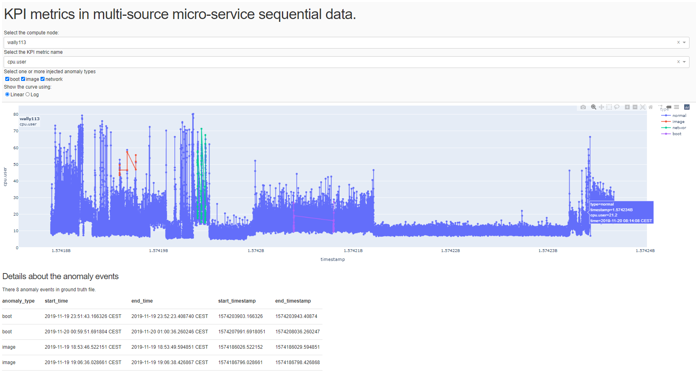

# Data Process

1. Generate ground truth from `report` file. Run `gt_process.py`. Anomaly label file is generated at `anomaly_label_[DATASET].csv`.
[DATASET] can be 'concurrent' or 'sequential'.

2. Load and process the KPI data. Run `ts_process.py`. Processed data is saved at dir `result_extracted_data`.

3. View the dataset and anomaly events extracted from Rally Report using [*Dash*](https://dash.plotly.com/introduction), which is a python visualization tool base on *Flask, Plotly.js, and React.js*. Run `view_dataset.py`, then visit http://127.0.0.1:8050/ in your web browser (by default) to view the data and anomaly events.

(Unzip the files in `result_extracted_data` before running `view_dataset.py`)

## Example



## Requirements

```
Package                            Version
---------------------------------- -----------
dash                               1.19.0
dash-core-components               1.15.0
dash-daq                           0.5.0
dash-html-components               1.1.2
dash-renderer                      1.9.0
dash-table                         4.11.2
Flask                              1.1.2
Flask-Compress                     1.9.0
Markdown                           2.6.11
MarkupSafe                         1.1.0
numpy                              1.16.2+mkl
pandas                             0.22.0
pandocfilters                      1.4.2
plotly                             4.14.3
scikit-learn                       0.20.3
```
